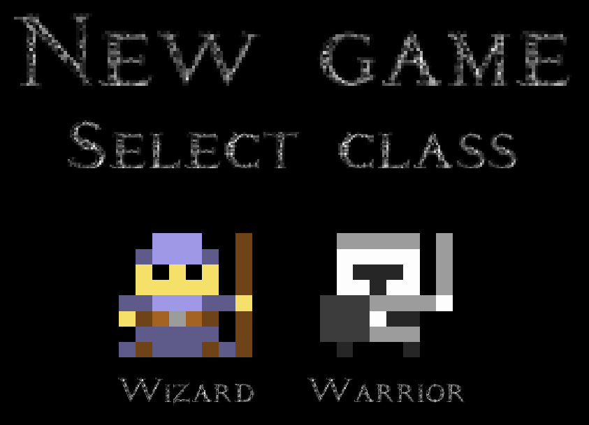
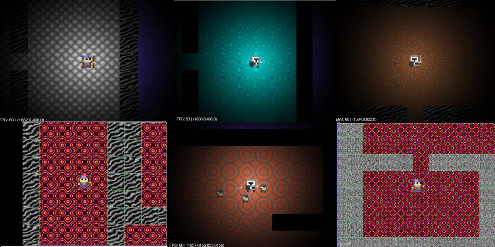
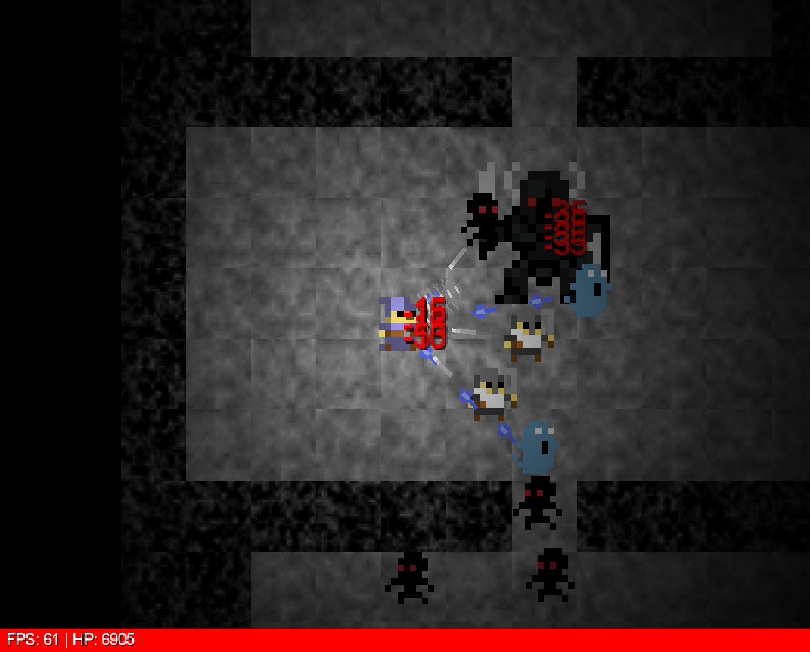

# pcg-roguelike

## Authors
[BugDeveloper](https://github.com/BugDeveloper/)  
[Cr0s](https://github.com/epunwds)

## Features
* Two characters to choose from.
* Procedural dungeons.
* Procedural textures.
* Bosses.
* Memes.

## Screenshots
**New game screen**  

**Dungeon variations**  

**Boss**  


## How to run using Gradle
In repo's game folder execute:
```
./gradlew run
```

### Known bugs
* Mobes sometimes may see you through the walls.
* Mobes can be stucked in the walls.
* There is "shadow wall" in the middle of the map.